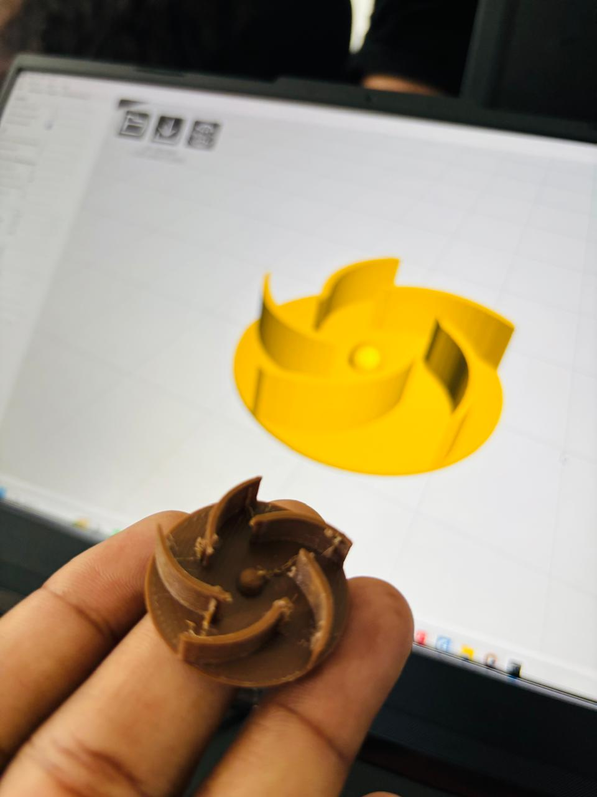
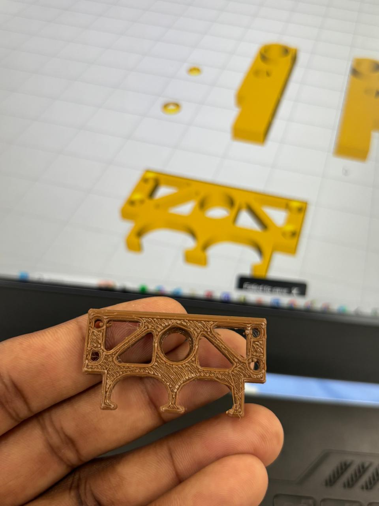

# Ventilator 3D-Printed Mechanical Design

<p align="center">
  <b>CAD Design • FDM 3D Printing • Mechanical Prototyping</b>
</p>

<p align="center">
  A mechanical design project focused on the development and fabrication of a custom ventilator prototype using CAD modelling and FDM 3D printing.
</p>

---

## Project Preview

<table>
  <tr>
    <td align="center">
      <br>
      <b>Ventilator Impeller Prototype</b>
    </td>
    <td align="center">
      <br>
      <b>Ventilator Mounting Bracket</b>
    </td>
  </tr>
</table>

---

## Project Overview

This project demonstrates the design and fabrication of mechanical components for a custom ventilator prototype.

The complete development process involved:

- CAD modelling
- Mechanical component design
- STL model preparation
- FDM 3D printing
- Prototype fabrication
- Physical design evaluation
- Mechanical fit verification

The project mainly consists of two custom-designed components:

1. **Ventilator Impeller**
2. **Ventilator Mounting Bracket**

---

## Ventilator Impeller

<p align="center">
  
</p>

The ventilator impeller was designed with curved blades to generate airflow during rotational operation.

### Main Features

- Custom curved blade geometry
- Compact circular design
- Central shaft mounting section
- Suitable for FDM 3D printing
- Designed for rapid prototyping
- Easy to modify for future design iterations

The component was 3D printed to evaluate the overall shape, geometry, printability and mechanical feasibility of the design.

---

## Ventilator Mounting Bracket

<p align="center">
  
</p>

The mounting bracket was designed to provide structural support and component mounting for the ventilator assembly.

### Main Features

- Lightweight structural design
- Multiple mounting holes
- Curved retaining sections
- Material-saving geometric cutouts
- Compact mechanical structure
- Suitable for rapid prototyping
- Designed for FDM manufacturing

The prototype was fabricated to evaluate mechanical fit, mounting positions and overall manufacturability.

---

## Design and Manufacturing

| Parameter | Details |
|---|---|
| Design Type | Mechanical CAD Design |
| Manufacturing Method | FDM 3D Printing |
| Project Type | Ventilator Mechanical Prototype |
| Components | Impeller and Mounting Bracket |
| CAD Software | Add CAD software used |
| Material | Add printing material |
| 3D Printer | Add printer model |
| File Formats | STL / STEP / CAD Source Files |

---

## Design Workflow

```text
Concept Development
        ↓
CAD Modelling
        ↓
Mechanical Design Refinement
        ↓
STL Export
        ↓
Slicing
        ↓
FDM 3D Printing
        ↓
Physical Prototype
        ↓
Mechanical Evaluation
        ↓
Design Improvement
